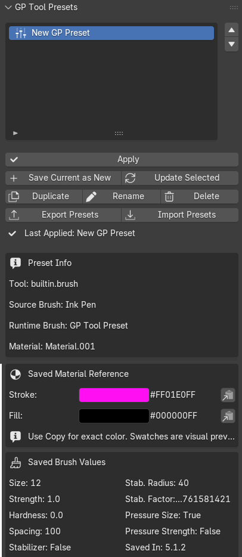

# GP Tool Presets

**GP Tool Presets** is a Blender extension for saving and reapplying Grease Pencil tool setups.

It is designed for 2D artists, animators, comic creators, storyboard artists, and other Grease Pencil users who regularly switch between drawing tools and settings.

**Version:** v1.1.0  
**Author / Maintainer:** Dk  
**Blender:** 5.1 and 5.2  
**License:** MIT

---

## Screenshot



---

## Overview

GP Tool Presets saves the current Grease Pencil tool setup as a reusable preset and applies it later.

It works with freehand brushes and other Grease Pencil drawing tools where Blender exposes their settings, including:

- Draw
- Eraser
- Curve
- Circle
- Box
- Fill
- Other Grease Pencil drawing tools

A preset can store values such as brush size, strength, hardness, spacing, pressure options, stabilizer settings, tool settings, Fill settings, color source, and material reference information.

---

## Main Features

- Save the current setup as a new preset
- Apply a saved preset
- Update an existing preset
- Rename, duplicate, delete, and reorder presets
- Export and import preset libraries as JSON
- Show detailed information for the selected preset
- Show stroke and fill color previews
- Copy exact stroke and fill hex values
- Confirm before overwriting or deleting a preset
- Use one reusable `GP Tool Preset` runtime brush
- Support Blender 5.1 and Blender 5.2
- Detect Material and Color Attribute color modes
- Capture Blender 5.2 Fill settings where exposed

---

## Core Design

The extension follows a deliberately safe design:

```text
Presets save values.
One GP Tool Preset brush receives the applied values.
Materials are reference-only.
```

The extension does not create one brush per preset. All presets use the same reusable runtime brush:

```text
GP Tool Preset
```

Applying a preset overwrites that runtime brush with the saved settings. This keeps Blender's brush list clean and predictable.

---

## Supported Preset Information

Depending on the active tool and what Blender exposes through its API, a preset may store:

- Active tool ID
- Source brush name
- Brush size
- Brush strength
- Brush hardness
- Brush spacing
- Pressure size
- Pressure strength
- Pressure hardness
- Pressure spacing
- Pressure jitter
- Stabilizer state
- Stabilizer radius
- Stabilizer factor
- Angle and angle factor
- Jitter
- Stroke method
- Direction
- Falloff shape
- Grease Pencil brush settings
- Tool settings
- Fill-related settings
- Material name as reference
- Color source
- Stroke color and hex value
- Fill color and hex value
- Blender version used when saving

Not every tool exposes the same settings, so the saved information can vary by tool.

---

## Blender 5.2 Support

Blender 5.2 changed several Grease Pencil drawing workflows. GP Tool Presets v1.1.0 uses capability checks instead of relying only on fixed version checks.

The extension tries to save and apply a setting only when Blender exposes it.

### Fill Tool Support

Where available, Fill presets can include settings associated with:

- Fill algorithm
- Gap detection and closure
- Precision
- Invert
- Boundary settings
- Extension settings
- Threshold values
- Guide settings
- Layer-related settings
- Radius and factor values

### Blender 5.1 Fallback

A preset created in Blender 5.2 may contain settings unavailable in Blender 5.1.

When used in Blender 5.1:

- Supported values are applied
- Unsupported values are skipped
- The rest of the preset remains usable

---

## Material and Color Workflow

GP Tool Presets does not create, duplicate, edit, delete, or recreate Grease Pencil materials.

Material information is stored as reference data only:

- Material name
- Color source
- Stroke color
- Fill color
- Stroke hex value
- Fill hex value

When applying a preset:

- If the saved material already exists in the current Blender file, the extension tries to select it.
- If the material does not exist, material switching is skipped.
- Users can recreate the material manually using the saved color previews and hex values.

For materials that need to be reused across projects, Blender's material asset-library workflow is recommended.

---

## Material Mode and Color Attribute Mode

Blender 5.2 can use colors from different sources. GP Tool Presets detects whether the active setup uses:

- **Material**
- **Color Attribute**

### Material Mode

The extension reads the stroke and fill colors from the Grease Pencil material.

### Color Attribute Mode

The extension reads the active brush or paint colors instead of assuming that the referenced material contains the visible colors.

When the preset is applied, those Color Attribute values are restored to the single `GP Tool Preset` runtime brush where Blender exposes the relevant properties.

This prevents the black-and-grey preview problem that can occur when the visible drawing colors come from Color Attribute mode while the referenced material itself remains black or grey.

---

## Saved Color Reference

The preset information panel shows:

```text
Stroke: [color preview] #HEX [Copy]
Fill:   [color preview] #HEX [Copy]
```

The swatches are visual previews. Use the copy button beside the hex value for exact color recreation.

```text
Use Copy for exact color. Swatches are visual previews.
```

Only stroke and fill colors are shown because those are the relevant Grease Pencil color values.

---

## Preset Information Panel

The selected preset can display:

- Tool
- Source brush
- Runtime brush
- Material name
- Color source
- Stroke and fill color previews
- Stroke and fill hex values
- Size
- Strength
- Hardness
- Spacing
- Stabilizer state
- Stabilizer radius and factor
- Pressure size and strength
- Fill-related settings
- Blender version used when saving

This helps users understand a preset before applying or updating it.

---

## Installation

1. Download the release ZIP.
2. Open Blender.
3. Go to:

```text
Edit > Preferences > Extensions
```

4. Install the extension from disk.
5. Select the downloaded ZIP.
6. Enable **GP Tool Presets**.
7. Open the 3D Viewport sidebar with `N`.
8. Select the **GP Presets** tab.

Sidebar location:

```text
View3D > Sidebar > GP Presets
```

---

## Usage

### Save a New Preset

1. Select a Grease Pencil object.
2. Select the drawing tool or brush.
3. Adjust the tool and brush settings.
4. Select the material or color mode to use as reference.
5. Click **Save Current as New**.
6. Enter a preset name.

### Apply a Preset

1. Select a preset from the list.
2. Click **Apply**.
3. The extension applies the saved values to `GP Tool Preset`.
4. If the saved material exists, the extension tries to select it.

### Update a Preset

Use **Update Selected** to overwrite the selected preset with the current setup.

A confirmation dialog appears before the preset is replaced.

### Delete a Preset

Use **Delete** to remove the selected preset.

A confirmation dialog appears because Blender Undo may not restore extension preset data.

Deleting a preset:

- Removes only the preset entry
- Does not delete the runtime brush
- Does not delete materials
- Does not alter toolbar data

### Duplicate, Rename, and Reorder

- **Duplicate** creates a copy of the selected preset.
- **Rename** changes the preset name without changing its settings.
- The up and down controls reorder presets in the list.

### Export and Import

Preset libraries can be exported and imported as JSON files.

This is useful for:

- Backups
- Moving presets between Blender installations
- Sharing preset collections
- Migrating between Blender 5.1 and 5.2

Exported JSON files contain settings and color references. They do not contain real Blender materials or external assets.

---

## Recommended Material Workflow

For reusable materials:

1. Create the Grease Pencil material manually.
2. Save or mark it as a Blender asset.
3. Keep it in a reusable Blender asset library.
4. Use GP Tool Presets for tool and brush settings.
5. Use Blender's asset system for material reuse.

This separation avoids duplicate materials and protects existing artwork.

---

## Known Limitations

- Blender does not expose every Grease Pencil setting through the same API path.
- Available settings vary by tool.
- Some Blender 5.2 values are unavailable in Blender 5.1.
- Missing materials are not recreated automatically.
- Exported JSON files do not contain Blender material data-blocks.
- Future Blender API changes may require compatibility updates.

---

## Safety Rules

```text
One visible extension brush only.
Presets store values only.
Materials are reference-only.
Materials are never created automatically.
Materials are never edited automatically.
Materials are never deleted automatically.
Deleting presets does not delete Blender data-blocks.
Updating presets requires confirmation.
Deleting presets requires confirmation.
```

---

## Version History

### v1.1.0

Blender 5.2 compatibility and color-source update.

- Added capability-based Blender 5.2 Fill-setting capture
- Added Fill-related information to preset details
- Added Blender 5.1 fallback behavior for unsupported settings
- Added Material and Color Attribute detection
- Saved and restored Color Attribute values where exposed
- Fixed black-and-grey previews caused by reading only material colors
- Preserved the one-brush and reference-only material design

### v1.0.0

First official release.

- Added one reusable `GP Tool Preset` runtime brush
- Added preset saving and applying
- Added material references
- Added stroke and fill swatches and hex copy buttons
- Added update and delete confirmations
- Added preset reordering
- Added import and export support
- Added the detailed preset information panel

---

## License

MIT License.
